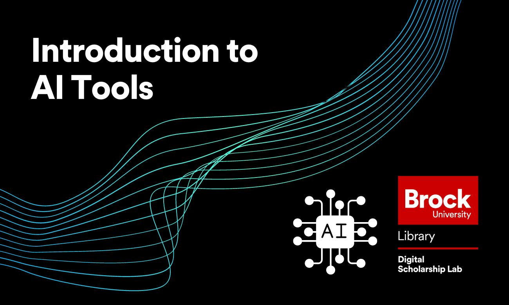

# Introduction to AI Tools
This workshop will provide an introduction to the basics of what an AI (Artificial Intelligence) is and what common uses AI has today.  The session will be broken up into two parts:

- A slideshow and discussion section where we will discuss AI
- A "play" section where we will explore some popular free online AI tools like chatGPT and Dream.ai.

No prior experience with this topic is needed for this workshop.

*Estimated length of workshop: 1 hour*

----

## Setup Instructions
In preparation for this workshop you may optionally create accounts on any of the tools below that you might want to try during the play portion of the session.  This can also be done during the session.

- [OpenAI/ChatGPT](https://chat.openai.com/)
- [Dream.ai](https://dream.ai/)
- [Google AI Test Kitchen](https://aitestkitchen.withgoogle.com/)
- [Runway AI Tools](https://app.runwayml.com/)

----

## Helpful Materials
In addition to the AI tools listed in the Setup section above, some other AI tools that you may want to try during the "play" portion of the workshop (or after the workshop) are:

- [Google Translate](https://translate.google.com/)
- [Google Maps](https://www.google.com/maps)

----

**This workshop is brought to you by the Brock University Digital Scholarship Lab.  For a listing of our upcoming workshops go to [Experience BU](https://experiencebu.brocku.ca/organization/dsl) if you are a Brock affiliate or [Eventbrite page](https://www.eventbrite.ca/o/brock-university-digital-scholarship-lab-21661627350) for external attendees.**

